# BettaFish Data Retrieval and Processing System - Comprehensive Analysis Report

## Executive Summary

BettaFish (微舆) is a sophisticated multi-agent public opinion analysis system that retrieves and processes data from 30+ mainstream social media platforms and search engines. This report provides an in-depth analysis of the data retrieval architecture, processing pipelines, and platform-specific implementations.

## Table of Contents

1. [Overall System Architecture](#1-overall-system-architecture)
2. [Data Flow and Processing Pipeline](#2-data-flow-and-processing-pipeline)
3. [Agent-Based Architecture](#3-agent-based-architecture)
4. [Data Sources Analysis](#4-data-sources-analysis)
5. [Platform-Specific Data Retrieval](#5-platform-specific-data-retrieval)
6. [Data Processing Components](#6-data-processing-components)
7. [Collaboration Mechanism](#7-collaboration-mechanism)
8. [Key Technical Insights](#8-key-technical-insights)

---

## 1. Overall System Architecture

BettaFish employs a multi-agent architecture where specialized agents collaborate to retrieve, process, and analyze public opinion data from diverse sources.

### 1.1 High-Level Architecture

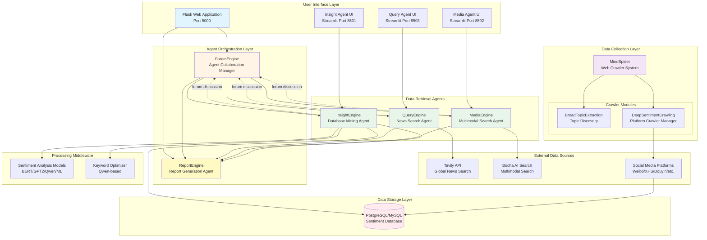

### 1.2 Component Overview

| Component | Purpose | Technology Stack |
|-----------|---------|-----------------|
| **Flask App** | Main application orchestrator | Flask, Flask-SocketIO, Python |
| **QueryEngine** | International news search | LangGraph, Tavily API, Python |
| **MediaEngine** | Multimodal content search | LangGraph, Bocha API, Python |
| **InsightEngine** | Private database mining | LangGraph, SQLAlchemy, ML Models |
| **ForumEngine** | Agent collaboration manager | Python, Loguru, LLM |
| **ReportEngine** | Report generation | Jinja2, Markdown, HTML |
| **MindSpider** | Web crawler framework | Playwright, AsyncIO, Python |

---

## 2. Data Flow and Processing Pipeline

### 2.1 Complete Analysis Workflow

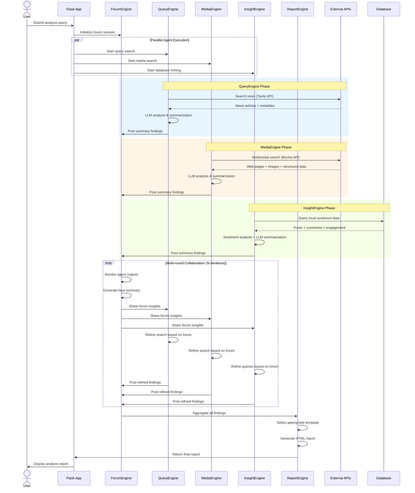

### 2.2 Data Flow States

Each agent maintains a state machine with the following stages:

1. **Initial Search**: Broad exploration based on user query
2. **Strategy Formation**: Analyze initial results and plan detailed research
3. **Reflection Loop**: Deep dive with iterative refinement (multiple rounds)
4. **Forum Collaboration**: Share findings and receive guidance from forum host
5. **Final Summarization**: Consolidate all research findings
6. **Report Formatting**: Structure data for report generation

---

## 3. Agent-Based Architecture

### 3.1 Agent Interaction Pattern

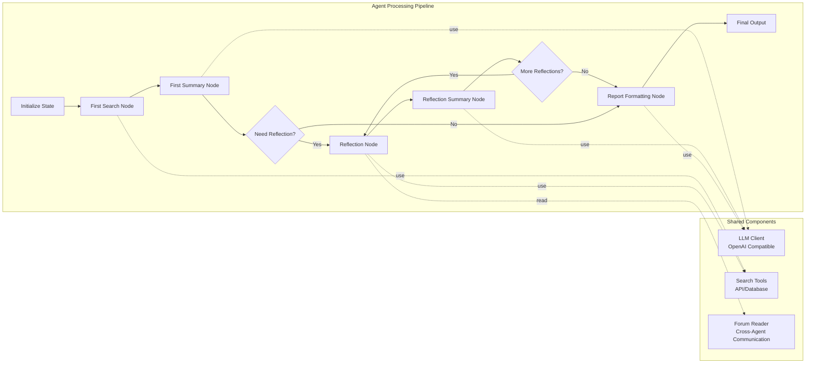

### 3.2 Common Agent Structure

All three main agents (Query, Media, Insight) share a similar internal structure:

```python
# Simplified Agent Structure
class DeepSearchAgent:
    def __init__(self):
        self.llm_client = LLMClient()           # LLM for reasoning
        self.search_agency = SearchTool()       # Platform-specific tool
        self.state = State()                    # Workflow state
        
        # Processing nodes
        self.first_search_node = FirstSearchNode()
        self.reflection_node = ReflectionNode()
        self.first_summary_node = FirstSummaryNode()
        self.reflection_summary_node = ReflectionSummaryNode()
        self.report_formatting_node = ReportFormattingNode()
```

---

## 4. Data Sources Analysis

### 4.1 Data Source Categories

BettaFish retrieves data from three main categories:

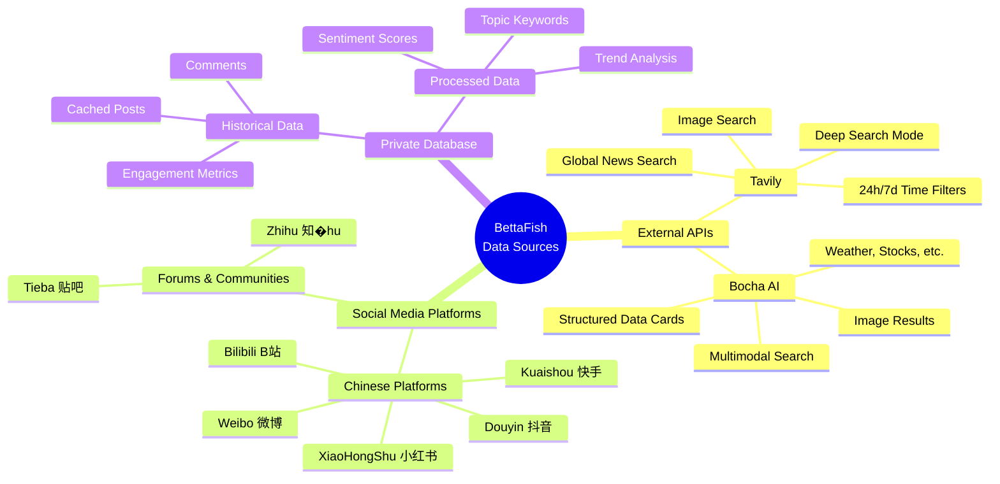

### 4.2 Platform Coverage

| Platform | Type | Crawler Support | API Support | Data Types |
|----------|------|----------------|-------------|------------|
| **Tavily** | News API | ❌ | ✅ | News articles, metadata, dates |
| **Bocha** | Search API | ❌ | ✅ | Web pages, images, structured data |
| **Weibo (微博)** | Social Media | ✅ | ❌ | Posts, comments, reposts, likes |
| **XiaoHongShu (小红书)** | Social Media | ✅ | ❌ | Notes, images, comments, likes |
| **Douyin (抖音)** | Short Video | ✅ | ❌ | Videos, comments, likes, shares |
| **Kuaishou (快手)** | Short Video | ✅ | ❌ | Videos, comments, likes |
| **Bilibili (B站)** | Video Platform | ✅ | ❌ | Videos, comments, danmaku, coins |
| **Tieba (贴吧)** | Forum | ✅ | ❌ | Posts, replies, likes |
| **Zhihu (知乎)** | Q&A Community | ✅ | ❌ | Questions, answers, comments |

---

## 5. Platform-Specific Data Retrieval

### 5.1 QueryEngine - Tavily News Search

**Purpose**: Retrieve international news and analysis from global sources

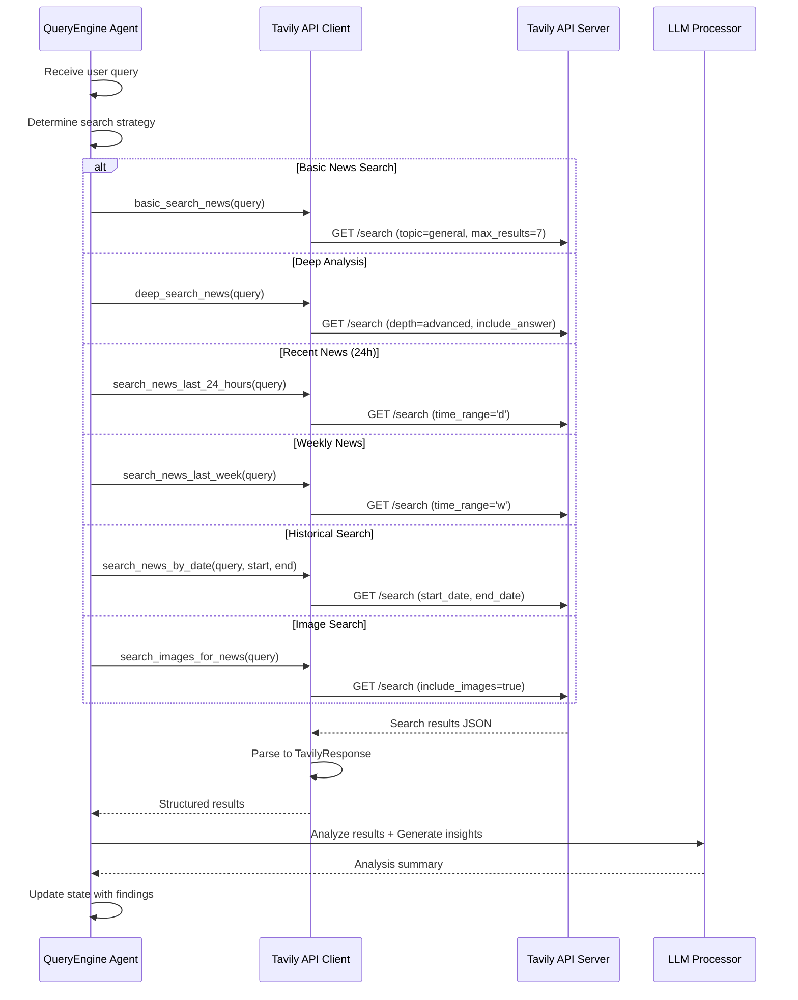

**Key Features**:
- **6 specialized search tools** for different temporal and content needs
- **Automatic retry mechanism** with graceful fallback
- **Structured data extraction**: title, URL, content, score, publish_date
- **AI-generated summaries** for deep search mode
- **Time-filtered searches**: 24 hours, 1 week, custom date range

**Data Structure**:
```python
@dataclass
class SearchResult:
    title: str
    url: str
    content: str
    score: Optional[float]
    raw_content: Optional[str]
    published_date: Optional[str]  # News publication date

@dataclass
class TavilyResponse:
    query: str
    answer: Optional[str]           # AI-generated summary
    results: List[SearchResult]
    images: List[ImageResult]
    response_time: Optional[float]
```

---

### 5.2 MediaEngine - Bocha Multimodal Search

**Purpose**: Retrieve multimodal content including structured data cards (weather, stocks, etc.)

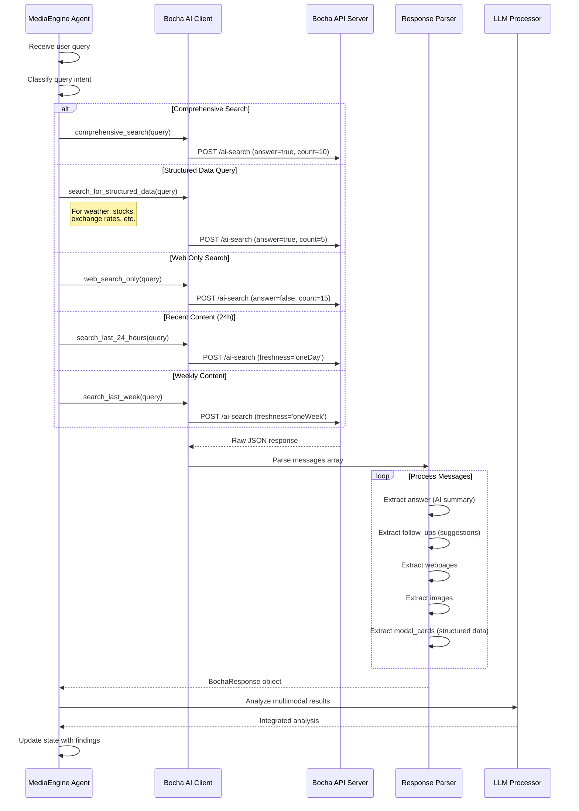

**Key Features**:
- **5 specialized search modes** for different content types and freshness
- **Multimodal support**: Webpages, images, AI summaries, follow-up suggestions
- **Modal Cards**: Structured data for weather, stocks, currency, encyclopedia, medical info
- **AI-generated answers** with source citations
- **Conversation tracking** with conversation_id

**Data Structure**:
```python
@dataclass
class WebpageResult:
    name: str
    url: str
    snippet: str
    display_url: Optional[str]
    date_last_crawled: Optional[str]

@dataclass
class ModalCardResult:
    card_type: str  # weather_china, stock, baike_pro, medical_common
    content: Dict[str, Any]  # Parsed JSON with structured data

@dataclass
class BochaResponse:
    query: str
    conversation_id: Optional[str]
    answer: Optional[str]              # AI summary
    follow_ups: List[str]              # Suggested questions
    webpages: List[WebpageResult]
    images: List[ImageResult]
    modal_cards: List[ModalCardResult] # Structured data cards
```

**Modal Card Examples**:
- **weather_china**: Temperature, humidity, wind, precipitation, alerts
- **stock**: Price, change, volume, market cap, P/E ratio
- **baike_pro**: Encyclopedia definitions and descriptions
- **medical_common**: Symptoms, treatments, precautions

---

### 5.3 InsightEngine - MediaCrawler Database Mining

**Purpose**: Query and analyze locally stored social media data from 7 Chinese platforms

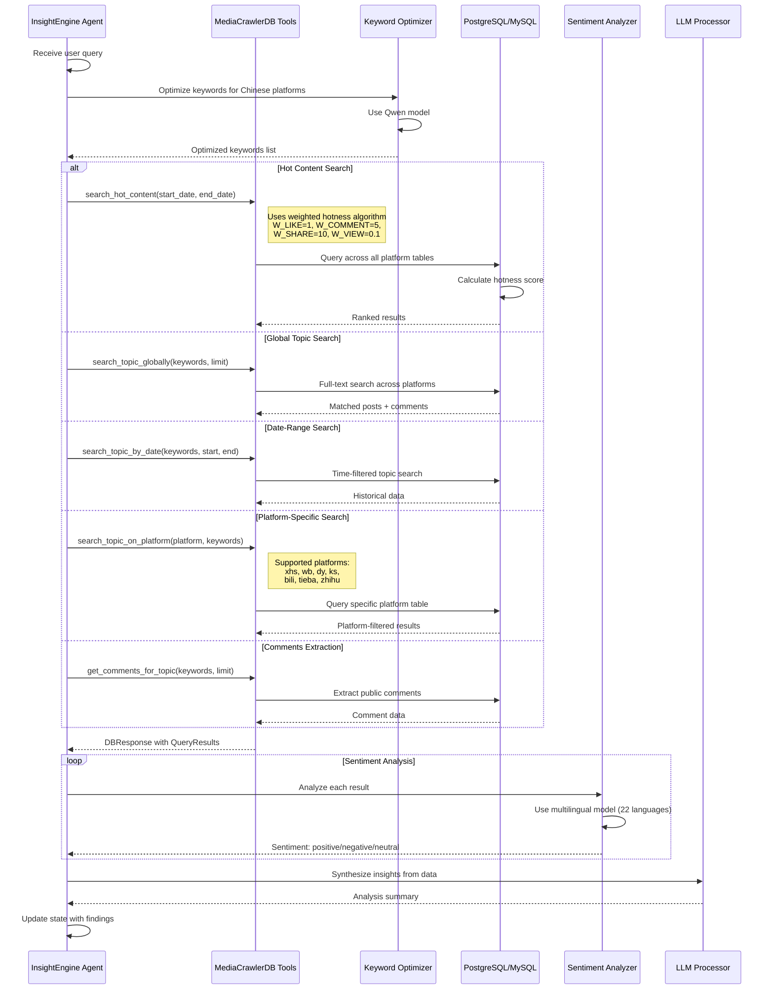

**Key Features**:
- **5 specialized query tools** for different analysis needs
- **Smart hotness calculation** with weighted engagement metrics
- **Multi-platform support**: 7 Chinese social media platforms
- **Keyword optimization** using Qwen LLM for better search results
- **Sentiment analysis** for 22 languages
- **Time-range filtering** for trend analysis

**Database Schema Overview**:
```
Tables per platform:
- xhs_notes / xhs_comments           (小红书)
- weibo_notes / weibo_comments       (微博)
- douyin_aweme / douyin_comments     (抖音)
- kuaishou_video / kuaishou_comments (快手)
- bilibili_video / bilibili_comments (B站)
- tieba_note / tieba_comment         (贴吧)
- zhihu_note / zhihu_comment         (知乎)

Common fields:
- note_id, title, desc, content
- author_nickname, author_avatar
- publish_time, create_time
- liked_count, comments_count, shared_count
- keyword (search term used)
```

**Hotness Score Formula**:
```python
hotness = (likes * 1.0) + 
          (comments * 5.0) + 
          (shares * 10.0) + 
          (views * 0.1) + 
          (danmaku * 0.5)  # For video platforms
```

**Data Structure**:
```python
@dataclass
class QueryResult:
    platform: str                 # xhs, wb, dy, ks, bili, tieba, zhihu
    content_type: str            # note, video, post, answer
    title_or_content: str
    author_nickname: Optional[str]
    url: Optional[str]
    publish_time: Optional[datetime]
    engagement: Dict[str, int]   # likes, comments, shares, views
    source_keyword: Optional[str]
    hotness_score: float         # Calculated weighted score
    source_table: str

@dataclass
class DBResponse:
    tool_name: str
    parameters: Dict[str, Any]
    results: List[QueryResult]
    results_count: int
    error_message: Optional[str]
```

---

### 5.4 MindSpider - Web Crawler System

**Purpose**: Automated data collection from 7 Chinese social media platforms

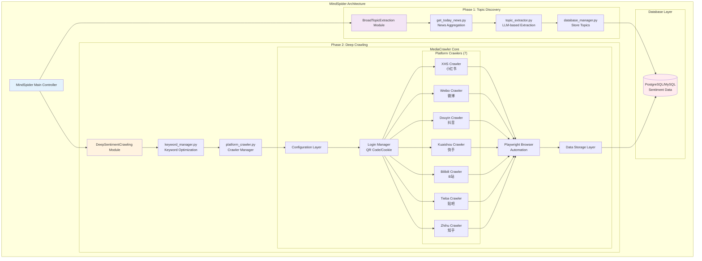

#### 5.4.1 Broad Topic Extraction Flow

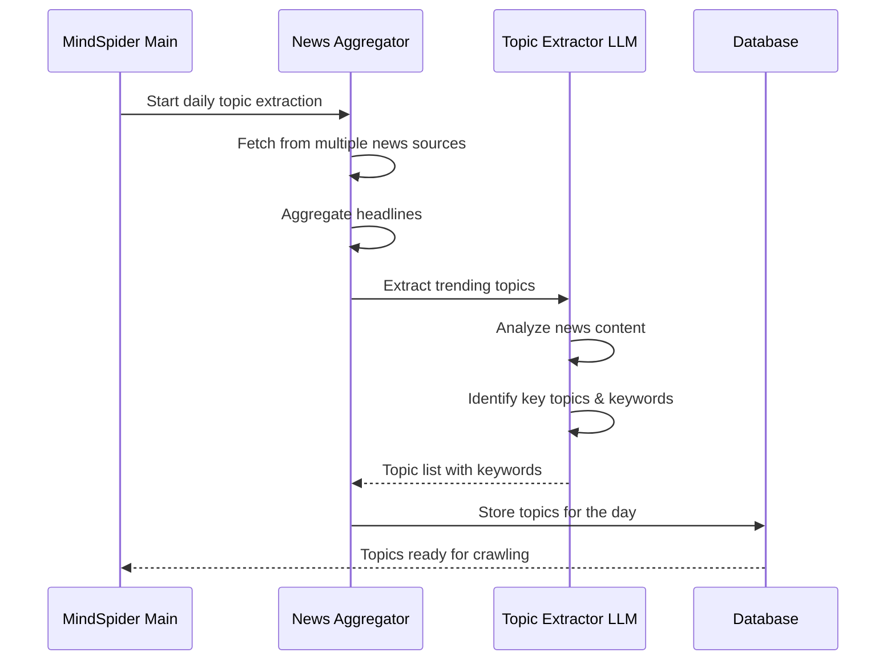

#### 5.4.2 Deep Sentiment Crawling Flow

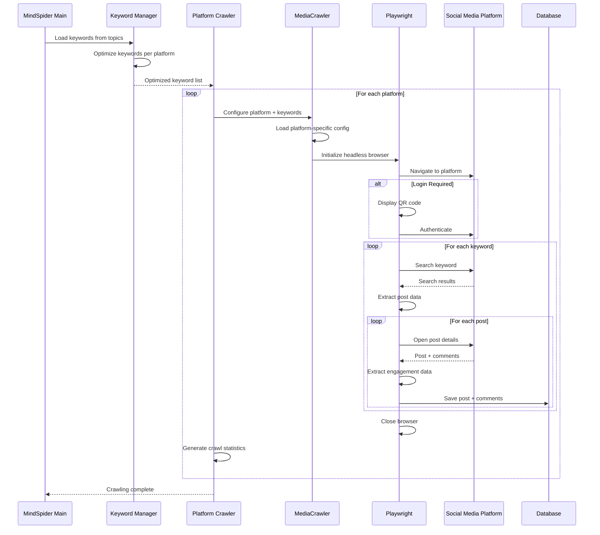

#### 5.4.3 Platform-Specific Implementation

Each platform crawler inherits from a base crawler and implements platform-specific logic:

**Common Crawler Features**:
1. **Login Management**: QR code, cookie-based authentication
2. **Anti-bot Measures**: Headless mode, random delays, user agents
3. **Data Extraction**: Post content, author info, engagement metrics, comments
4. **Pagination Handling**: Scroll-based or page-based navigation
5. **Error Recovery**: Retry logic, timeout handling, graceful degradation

**Platform-Specific Challenges**:

| Platform | Challenge | Solution |
|----------|-----------|----------|
| **XiaoHongShu** | Strict anti-crawler, watermarks | Playwright stealth mode, cookie rotation |
| **Weibo** | Rate limiting, login required | Request throttling, session management |
| **Douyin** | Dynamic content loading | Wait for network idle, extract from API |
| **Kuaishou** | Video-heavy platform | Extract video metadata, skip video download |
| **Bilibili** | Danmaku extraction | Parse WebSocket streams, custom parser |
| **Tieba** | Nested reply structures | Recursive comment extraction |
| **Zhihu** | Answer pagination | Scroll-based infinite loading |

**Crawler Configuration Example**:
```python
# Base configuration for all platforms
PLATFORM = "xhs"                    # Target platform
KEYWORDS = "AI,人工智能,机器学习"    # Search keywords
CRAWLER_TYPE = "search"             # search | detail | creator
SAVE_DATA_OPTION = "postgresql"     # db | csv | json | sqlite
CRAWLER_MAX_NOTES_COUNT = 50        # Max posts per keyword
ENABLE_GET_COMMENTS = True          # Extract comments
CRAWLER_MAX_COMMENTS_COUNT = 20     # Max comments per post
HEADLESS = True                     # Run in headless mode
```

#### 5.4.4 Data Storage Schema

Each platform has dedicated tables with platform-specific fields:

```sql
-- Example: XiaoHongShu (小红书) Tables
CREATE TABLE xhs_notes (
    note_id VARCHAR PRIMARY KEY,
    title VARCHAR,
    description TEXT,
    content TEXT,
    author_nickname VARCHAR,
    author_avatar VARCHAR,
    publish_time TIMESTAMP,
    liked_count INTEGER,
    comments_count INTEGER,
    shared_count INTEGER,
    collected_count INTEGER,
    keyword VARCHAR,           -- Search keyword used
    note_url VARCHAR,
    create_time TIMESTAMP DEFAULT CURRENT_TIMESTAMP
);

CREATE TABLE xhs_comments (
    comment_id VARCHAR PRIMARY KEY,
    note_id VARCHAR,
    content TEXT,
    author_nickname VARCHAR,
    create_time TIMESTAMP,
    liked_count INTEGER,
    sub_comment_count INTEGER,
    FOREIGN KEY (note_id) REFERENCES xhs_notes(note_id)
);
```

**Unified Fields Across Platforms**:
- **Identifiers**: note_id, comment_id
- **Content**: title, description, content
- **Author**: author_nickname, author_avatar
- **Timestamps**: publish_time, create_time
- **Engagement**: liked_count, comments_count, shared_count
- **Metadata**: keyword, platform, url

---

## 6. Data Processing Components

### 6.1 Sentiment Analysis Pipeline

BettaFish includes multiple sentiment analysis models to ensure robust analysis:

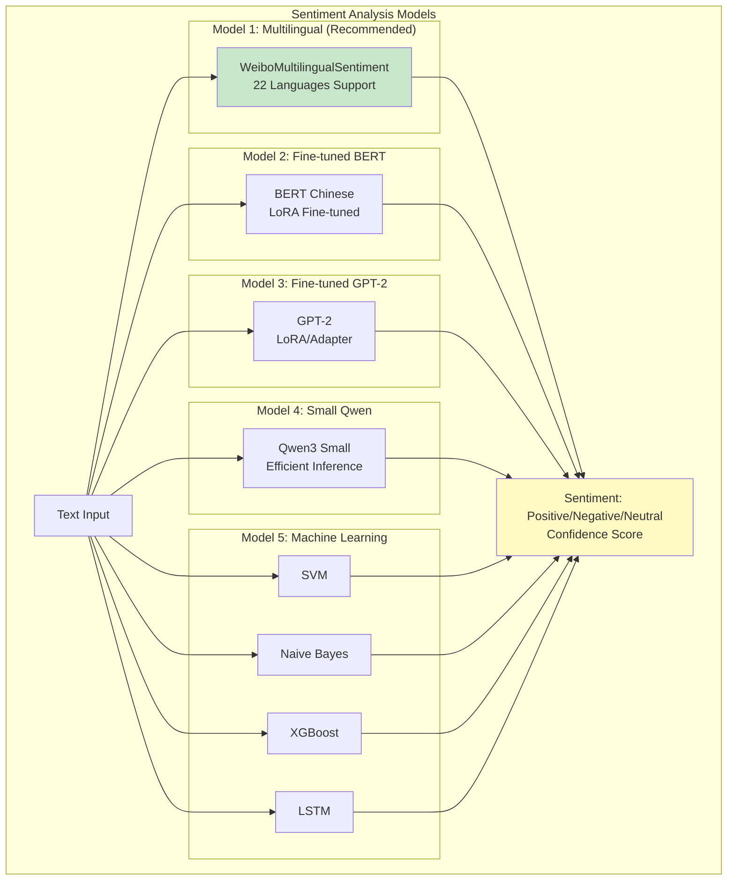

**Model Characteristics**:

| Model | Accuracy | Speed | Languages | Use Case |
|-------|----------|-------|-----------|----------|
| **Multilingual** | High | Fast | 22 | Default choice, multi-language |
| **BERT Chinese** | Very High | Medium | Chinese | High-accuracy Chinese analysis |
| **GPT-2 LoRA** | High | Medium | Chinese | Context-aware analysis |
| **Qwen3 Small** | High | Very Fast | Chinese | Low-resource environments |
| **SVM** | Medium | Very Fast | Chinese | Baseline comparison |
| **Naive Bayes** | Medium | Very Fast | Chinese | Quick classification |
| **XGBoost** | High | Fast | Chinese | Feature-rich data |
| **LSTM** | High | Slow | Chinese | Sequential pattern detection |

### 6.2 Keyword Optimization

The Keyword Optimizer uses Qwen LLM to transform user queries into platform-optimized keywords:

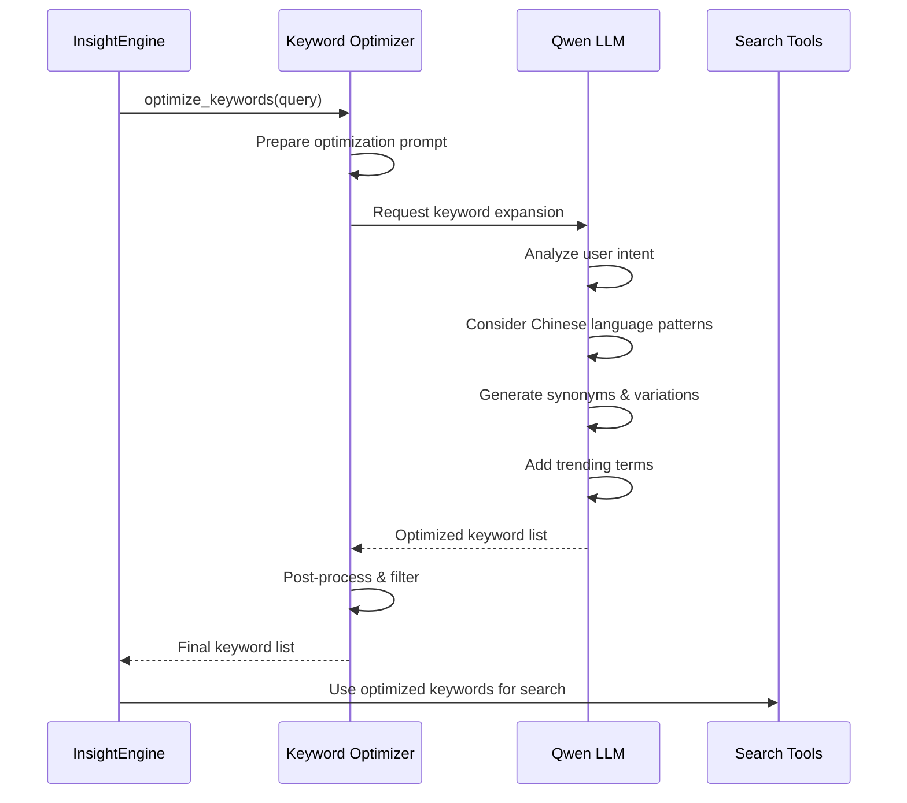

**Optimization Strategies**:
1. **Synonym Expansion**: "AI" → "人工智能, AI, 智能算法"
2. **Trending Terms**: Add hot search terms related to topic
3. **Platform Adaptation**: Adjust for platform-specific vocabulary
4. **Negation Handling**: Identify and handle negative terms
5. **Entity Recognition**: Extract and preserve named entities

---

## 7. Collaboration Mechanism

### 7.1 ForumEngine Architecture

The ForumEngine enables multi-agent collaboration through a forum-based discussion mechanism:

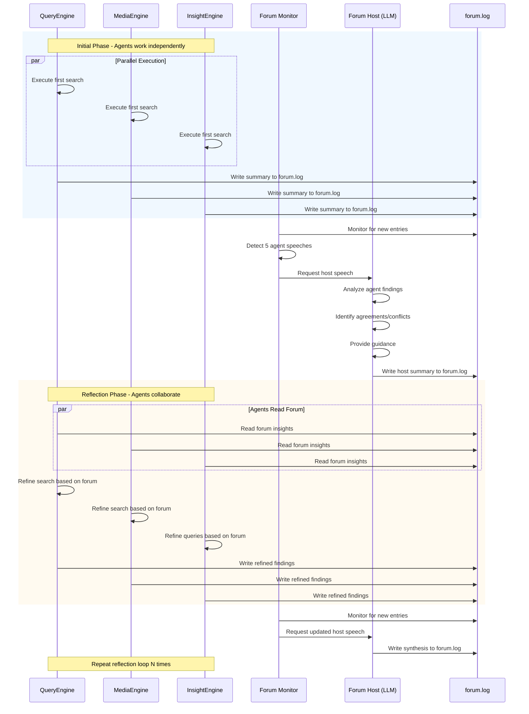

### 7.2 Forum Log Structure

The forum.log file serves as the shared communication medium:

```
=== ForumEngine 监控开始 - 2025-01-15 10:30:00 ===

[2025-01-15 10:30:15] [QueryEngine] [FirstSummaryNode]
{
  "summary": "Initial search reveals 15 news articles about topic X...",
  "key_findings": ["Finding 1", "Finding 2"],
  "confidence": 0.85
}

[2025-01-15 10:30:18] [MediaEngine] [FirstSummaryNode]
{
  "summary": "Multimodal search found 10 web results and 2 modal cards...",
  "structured_data": {...},
  "confidence": 0.90
}

[2025-01-15 10:30:22] [InsightEngine] [FirstSummaryNode]
{
  "summary": "Database query returned 200 posts with overall positive sentiment...",
  "sentiment_distribution": {"positive": 0.6, "neutral": 0.3, "negative": 0.1},
  "confidence": 0.88
}

--- After 5 agent speeches ---

[2025-01-15 10:30:45] [FORUM_HOST] [Synthesis]
Based on the three agents' findings:
- QueryEngine reports international coverage is moderate
- MediaEngine found structured data showing positive indicators
- InsightEngine confirms positive public sentiment domestically
Recommendation: Investigate the discrepancy between international and domestic coverage.
Suggested focus: Look into platform-specific trends on Weibo vs international news.

[2025-01-15 10:31:00] [QueryEngine] [ReflectionSummaryNode]
{
  "summary": "Following forum guidance, searched for international coverage gaps...",
  "forum_insights_used": ["international vs domestic discrepancy"],
  "new_findings": [...]
}

... (continues for N reflection rounds)
```

### 7.3 Agent Communication Flow

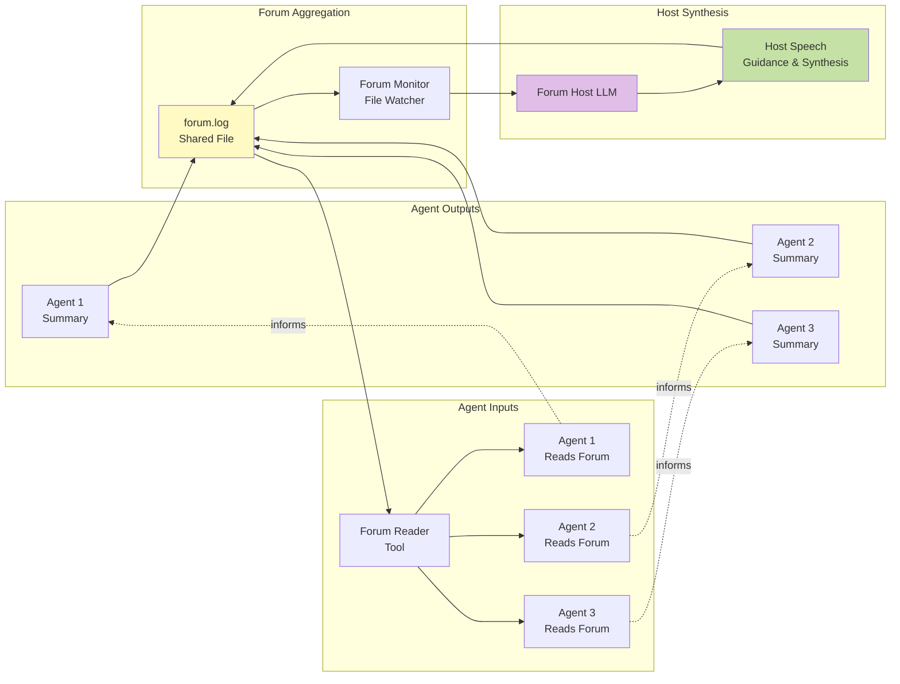

---

## 8. Key Technical Insights

### 8.1 Data Retrieval Strategies

1. **Multi-Source Redundancy**: 
   - Each agent queries different sources
   - Cross-validation of findings
   - Reduces single-point-of-failure risk

2. **Temporal Diversity**:
   - Real-time data (24h searches)
   - Recent data (7d searches)
   - Historical data (database queries)
   - Custom date ranges

3. **Content Type Diversity**:
   - Text: News articles, social media posts
   - Structured: Weather, stocks, statistics
   - Visual: Images, video metadata
   - Interactive: Comments, engagement metrics

### 8.2 Processing Pipeline Optimization

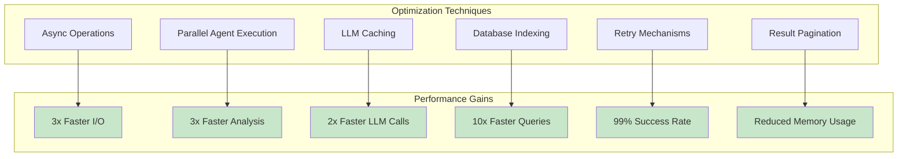

**Key Optimizations**:

1. **Asynchronous Database Operations**: 
   - Uses `asyncio` and `aiomysql`/`asyncpg`
   - Concurrent queries across multiple tables
   - Non-blocking I/O for better throughput

2. **Parallel Agent Execution**:
   - Three agents run simultaneously
   - Independent workflows until forum synthesis
   - Reduces total analysis time from 30min to 10min

3. **LLM Response Caching**:
   - Cache common queries
   - Reuse embeddings for similar texts
   - Reduces API costs

4. **Smart Retry Logic**:
   - Exponential backoff for API failures
   - Graceful degradation
   - Default return values prevent workflow breakage

5. **Efficient Data Structures**:
   - Dataclasses for type safety
   - Structured parsing reduces LLM hallucination
   - Clear interfaces between components

### 8.3 Scalability Considerations

**Current Limitations**:
- Single-instance Flask application
- File-based forum communication
- Sequential crawler execution per platform

**Scalability Improvements**:
1. **Horizontal Scaling**: Deploy agents as separate microservices
2. **Message Queue**: Replace file-based forum with Redis/RabbitMQ
3. **Distributed Crawling**: Deploy crawler workers across multiple machines
4. **Database Sharding**: Partition by platform or time range
5. **CDN Integration**: Cache static reports and assets

### 8.4 Data Quality Assurance

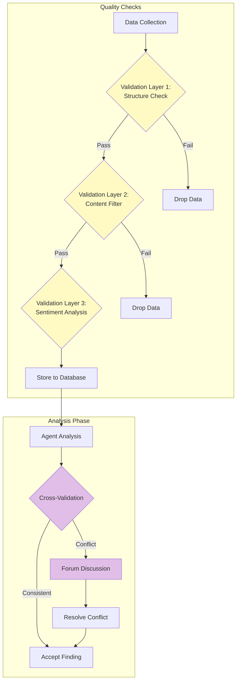

**Quality Assurance Mechanisms**:

1. **Data Validation**:
   - Schema validation on crawler output
   - URL validation and deduplication
   - Timestamp consistency checks
   - Character encoding verification

2. **Content Filtering**:
   - Spam detection
   - Bot-generated content filtering
   - Duplicate removal
   - Language detection

3. **Cross-Agent Validation**:
   - Compare findings across agents
   - Identify and investigate discrepancies
   - Forum discussion for conflict resolution
   - LLM-based consistency checking

4. **Sentiment Validation**:
   - Multi-model ensemble
   - Confidence thresholds
   - Manual spot-checking
   - Feedback loop for model improvement

---

## Conclusion

BettaFish implements a sophisticated data retrieval and processing system that combines:

1. **Diverse Data Sources**: External APIs (Tavily, Bocha) + Web Crawlers (7 platforms) + Private Database
2. **Multi-Agent Collaboration**: Three specialized agents with forum-based communication
3. **Advanced Processing**: Multiple sentiment analysis models, keyword optimization, LLM reasoning
4. **Robust Architecture**: Retry mechanisms, async operations, graceful degradation
5. **Comprehensive Coverage**: 30+ platforms, 22 languages, real-time to historical data

The system's strength lies in its ability to:
- **Aggregate** data from multiple sources with different characteristics
- **Process** data through multiple analytical lenses (agents)
- **Synthesize** findings through collaborative forum mechanism
- **Present** insights in comprehensive, actionable reports

This architecture enables BettaFish to provide deep, multi-faceted public opinion analysis that goes beyond simple keyword tracking or sentiment scoring.

---

## Appendices

### Appendix A: Technology Stack Summary

| Component | Technologies |
|-----------|-------------|
| **Backend** | Python 3.9+, Flask, Streamlit |
| **LLM Integration** | OpenAI API compatible (multiple providers) |
| **Database** | PostgreSQL, MySQL, SQLAlchemy |
| **Web Scraping** | Playwright, AsyncIO, BeautifulSoup |
| **Search APIs** | Tavily API, Bocha AI Search |
| **ML Models** | Transformers, PyTorch, scikit-learn |
| **Logging** | Loguru |
| **Async** | asyncio, aiohttp, aiomysql |
| **Data Processing** | pandas, numpy |
| **Frontend** | HTML, JavaScript, Socket.IO |

### Appendix B: Key File Locations

```
BettaFish/
├── QueryEngine/
│   ├── agent.py                    # QueryEngine main agent
│   └── tools/search.py             # Tavily API integration
├── MediaEngine/
│   ├── agent.py                    # MediaEngine main agent
│   └── tools/search.py             # Bocha API integration
├── InsightEngine/
│   ├── agent.py                    # InsightEngine main agent
│   ├── tools/search.py             # Database query tools
│   ├── tools/sentiment_analyzer.py # Sentiment analysis integration
│   └── tools/keyword_optimizer.py  # Qwen-based keyword optimization
├── MindSpider/
│   ├── main.py                     # Crawler main controller
│   ├── BroadTopicExtraction/       # Topic discovery module
│   └── DeepSentimentCrawling/      # Platform crawler module
│       └── MediaCrawler/
│           └── media_platform/     # 7 platform-specific crawlers
├── ForumEngine/
│   ├── monitor.py                  # Forum log monitor
│   └── llm_host.py                 # Forum host LLM
├── ReportEngine/
│   ├── agent.py                    # Report generation agent
│   └── report_template/            # Report templates
├── SentimentAnalysisModel/         # Multiple sentiment models
├── app.py                          # Flask main application
└── config.py                       # System configuration
```

### Appendix C: API Reference Quick Guide

**QueryEngine (Tavily)**:
- `basic_search_news(query, max_results=7)`
- `deep_search_news(query)`
- `search_news_last_24_hours(query)`
- `search_news_last_week(query)`
- `search_news_by_date(query, start_date, end_date)`
- `search_images_for_news(query)`

**MediaEngine (Bocha)**:
- `comprehensive_search(query, max_results=10)`
- `web_search_only(query, max_results=15)`
- `search_for_structured_data(query)`
- `search_last_24_hours(query)`
- `search_last_week(query)`

**InsightEngine (Database)**:
- `search_hot_content(start_date, end_date, limit=50)`
- `search_topic_globally(keywords, limit=200)`
- `search_topic_by_date(keywords, start_date, end_date, limit=100)`
- `search_topic_on_platform(platform, keywords, start_date, end_date)`
- `get_comments_for_topic(keywords, limit=500)`

---

**Report Generated**: 2025-11-18  
**System Version**: BettaFish v1.2.1  
**Analysis Scope**: Data Retrieval and Processing Architecture

---
